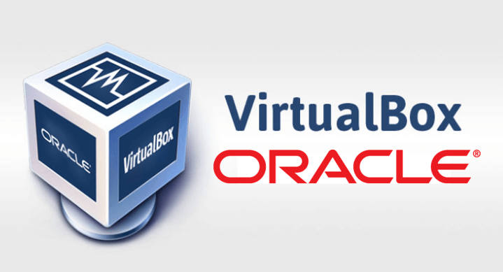

# Preparação de ambiente
### Vamos prepara o ambiente para desenvolvimento de aplicações

#### Nesta preparação iremos instalar e configurar os seguintes recursos:
 - Máquina virtual (VirtualBox)
 - Distribuição Linux (Ubuntu Server)
 - Nasm
 - Compilador de linguagem C
 - Configurar o IP e a porta de comunicação entre a máquina real e a virtual
 - Configurar o acesso via SSH entre o VSCode e o servidor Linux
 - Configurar as extensões: Material Icon, Nasm, SSH e linguagem C/C++

 #### Máquina virtual (VirtualBox)

 

 Máquina virtual é uma ferramenta que permite a criação de novos computadores e a instalação de sistemas operacionais, para estudo ou trabalho.

 Para nosso estudo iremos usar o VirtualBox da Oracle.
 Para fazer o download no link a seguir:

 <a href="https://www.virtualbox.org/wiki/Downloads" target="_blank"> VirtualBox </a>

 ##### Criando a máquina virtual para o nosso estudo

 - Configuração:
    > - Nome da máquina: Servidor
    > - Memória: 4GB(4096)
    > - Processador: 2
    > - Disco: 100GB
    > - IP e porta do Host: 127.0.0.1 e 22
    > - IP e porta do convidado: 10.0.2.15 e 22

- Tela inicial de configuração

- Tela de configuração do Hardware

- Tela de configuração do Disco

- Tela de sumário

- Tela de configuração de rede

- Tela de configuração de portas e IPs

#### Distribuição Ubuntu Server

Para o nosso estudo iremos utilizar uma distribuição Linux para servidores chamada Ubuntu. Acompanhe o processo de instalação:

Faça o download aqui:

<a href="https://ubuntu.com/download/server" target="_blank"> Ubuntu Server </a>

- Acompanhe a instalação:

- Tela de início de instalação

- Tela de seleção de idioma

- Tela de seleção de teclado

- Tela de tipo de instalação

- Tela de configuração do proxy

- Tela de pacotes de atualização

- Tela de configuração do disco 

- Tela de configuração do usuário

- Tela de configuração do SSH

- Tela do fim da instalação

